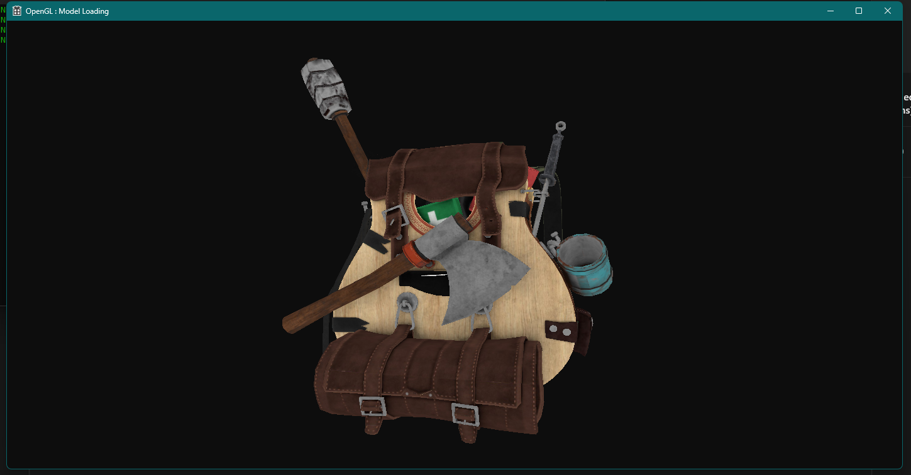
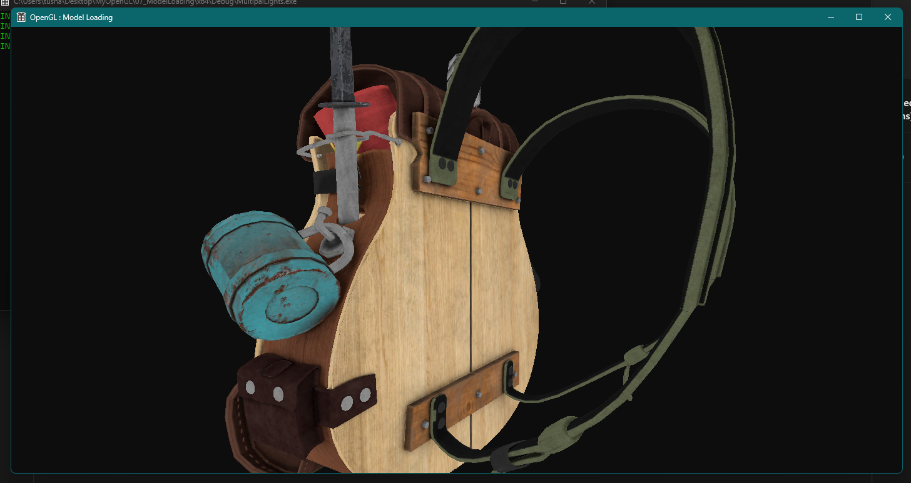
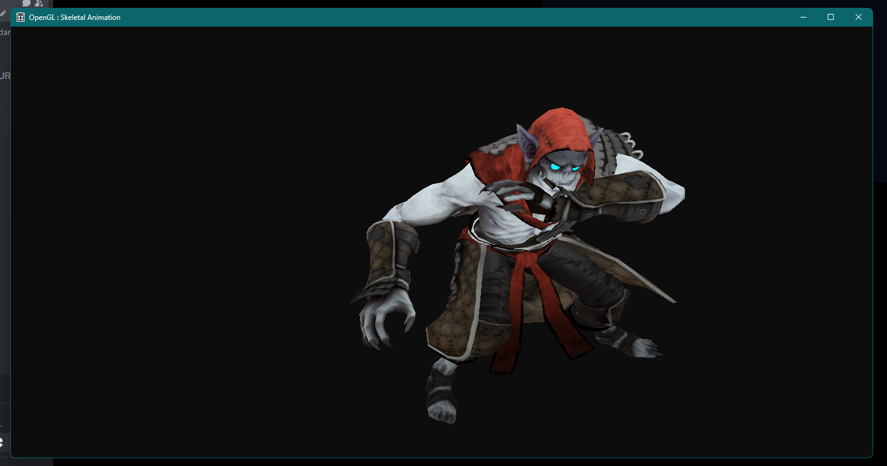
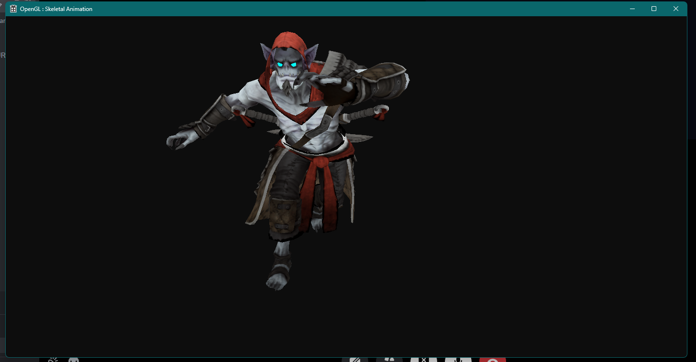

# OpenGL Model Loading and Animation

This repository demonstrates how to load 3D models and perform skeletal animation using OpenGL. It provides a practical implementation.

## Overview

This project covers two main areas:

1.  **Model Loading:** Demonstrates how to load 3D models from common file formats (e.g., OBJ, FBX) into your OpenGL application.
2.  **Skeletal Animation:** Showcases how to animate models using skeletal animations.

## Folder Structure

The repository is organized as follows:

*   **`01_ModelLoading`**: Contains the code and resources for loading and rendering a 3D model.
*   **`02_SkeletalAnimation`**: Contains the code and resources for implementing skeletal animation.
*   `.gitignore`: File for excluding untracked files in git.
*   `README.md`: This file.

## Screenshots

### Model Loading:

The `01_ModelLoading` folder shows how to load and render a 3D model as depicted in the following screenshots:

### Skeletal Animation:

The `02_SkeletalAnimation` folder demonstrates how to load a model with an armature and implement skeletal animation. The following screenshots showcase the result of this implementation:

